<div align="center">
  
</div>

</br>

# App para aluguel de carros

### A aplicação foi desenvolvida no curso da rocketseat

</br>

## Passos para iniciar o projeto:

```
expo install
```

```
expo start
```

</br>

<p>
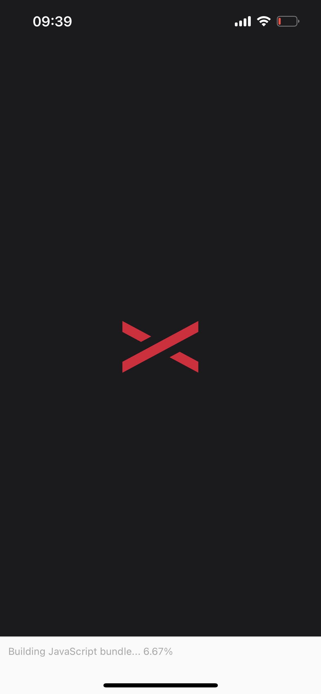
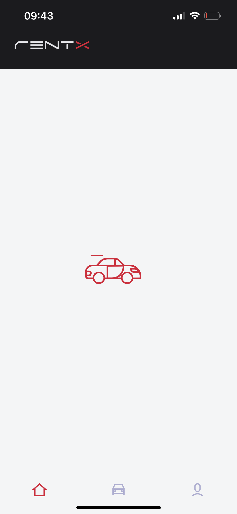
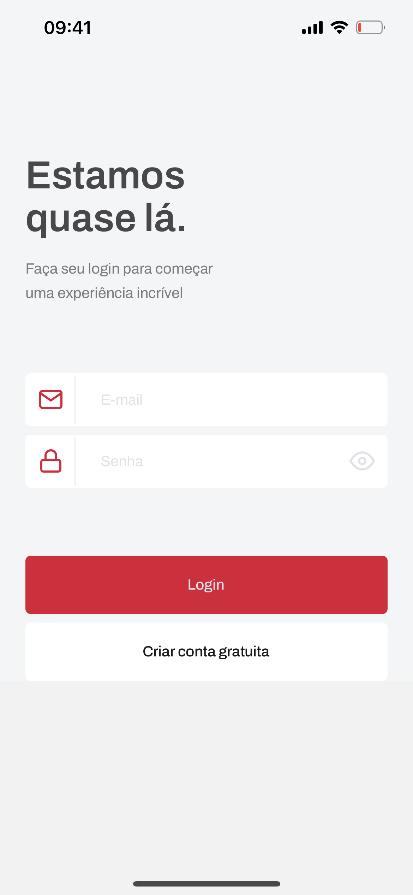 
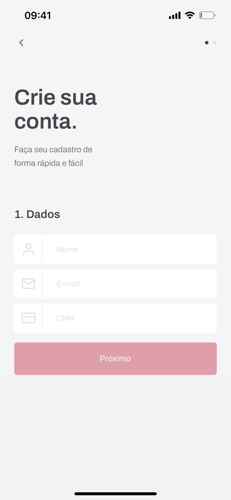
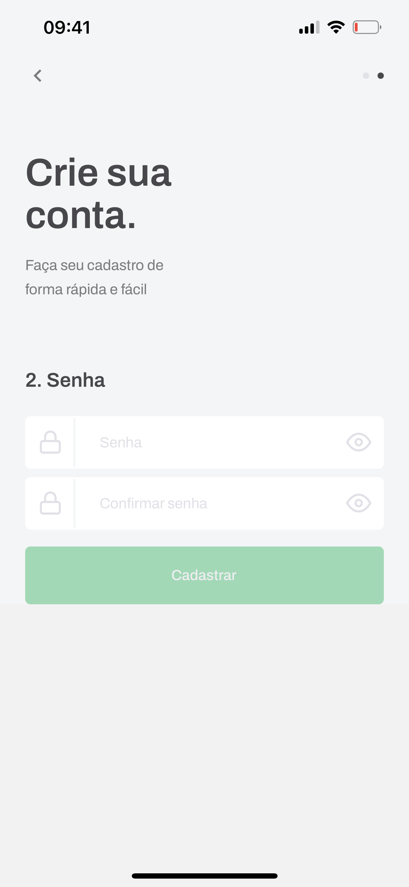
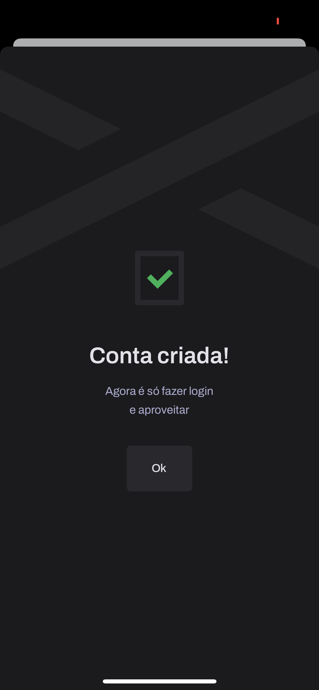
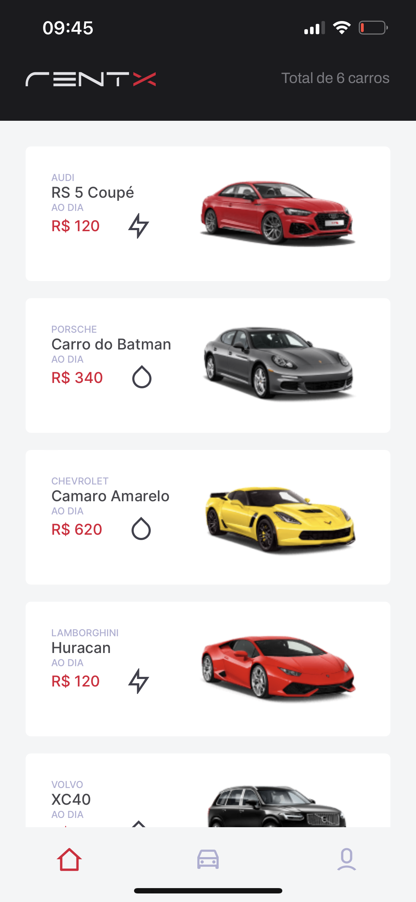
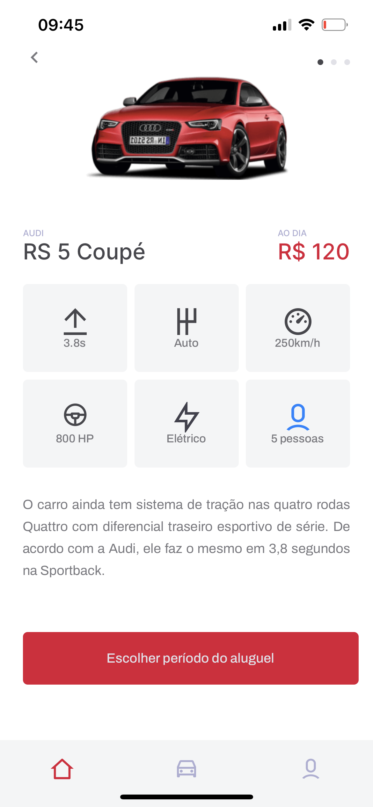
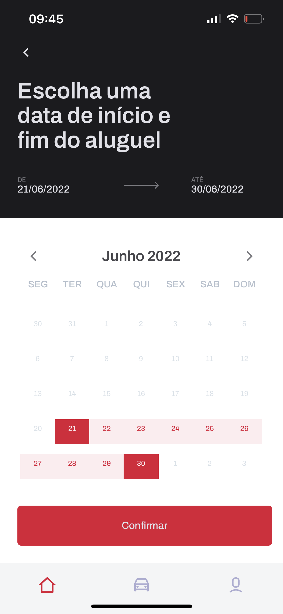
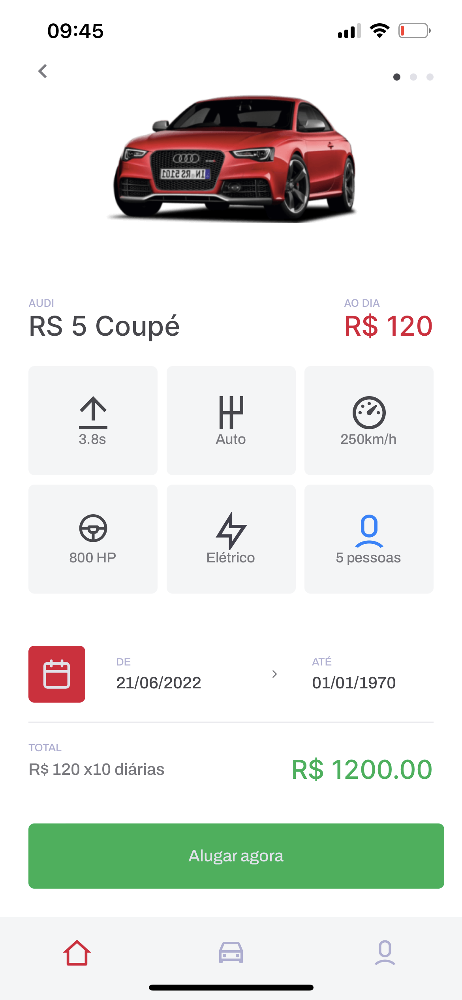
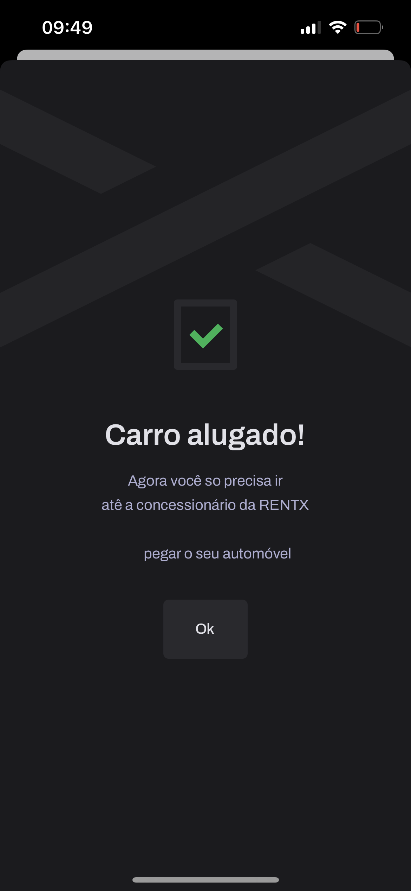
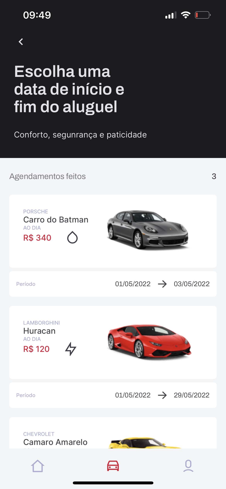
</p>

</br>

## Tecnologias :rocket:

- [React native](https://reactnative.dev/)
- [Typescript](https://www.typescriptlang.org)
- [styled-components](https://www.styled-components.com/)

Made with ♥ by Lucas Aguiar :wave: [Get in touch!](https://www.linkedin.com/in/lucasaguiiar)
